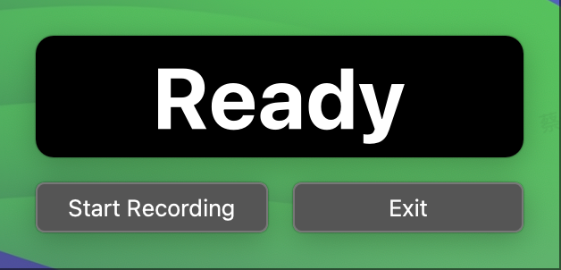

# 无 GUI 语音输入工具

本项目是一个在后台运行的、无图形用户界面（GUI）的语音输入工具。用户通过全局快捷键触发录音，录音内容被实时流式传输至语音识别服务进行处理，处理后的文本经过大语言模型修正，最终输出到系统剪贴板和本地文件。

## 特性

- **后台运行**: 启动后在后台驻留，不干扰用户正常操作。
- **快捷键控制**: 通过可配置的全局快捷键启动和停止录音。
- **录音与计时**: 录音时在屏幕上显示一个简易的倒计时浮窗。
- **实时 ASR**: 在录音过程中，将音频流式发送至 Groq Whisper API 进行语音转文本。
- **文本修正**: 将 ASR 结果交由 Groq Llama-3.3-70b 模型进行语义修正和优化。
- **代理支持**: 所有 API 请求均通过本地 `:7890` 端口的代理进行。
- **多平台兼容**: 核心功能支持 macOS 和 Windows。
- **结果输出**: 将最终文本复制到系统剪贴板，并保存为本地 `.txt` 文件。

## 截图



## 安装

1.  **克隆仓库**:
    ```bash
    git clone https://github.com/your-username/voice-input-via-python.git
    cd voice-input-via-python
    ```

2.  **创建虚拟环境**:
    ```bash
    python3 -m venv .venv
    source .venv/bin/activate  # 在 Windows 上使用 ` .venv\Scripts\activate`
    ```

3.  **安装依赖**:
    ```bash
    pip install -r requirements.txt
    ```

## 配置

1.  复制 `.env.template` 为 `.env`，并填入你的 Groq API 密钥。
2.  打开 `config.json` 文件。
3.  根据你的需求修改 `hotkeys`。
4.  确保 `proxy` 设置指向你正在运行的本地代理服务。

## 使用方法

1.  **启动程序**:
    ```bash
    python src/main.py
    ```

2.  **开始录音**: 按下你在 `config.json` 中设置的 `start_recording` 快捷键。
3.  **停止录音**: 按下 `stop_recording` 快捷键，或等待倒计时结束。
4.  **查看结果**:
    -   修正后的文本会自动复制到你的剪贴板。
    -   一份文本副本会保存在 `recordings` 目录下。

## 权限说明 (macOS)

在 macOS 上，你可能需要授予应用以下权限：
-   **辅助功能**: 用于监听全局快捷键。
-   **麦克风**: 用于录制音频。

首次运行时，系统通常会弹出授权提示。请按照提示在“系统设置” > “隐私与安全性”中进行授权。