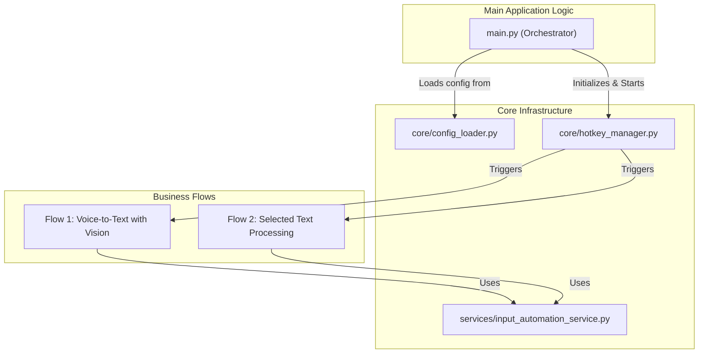
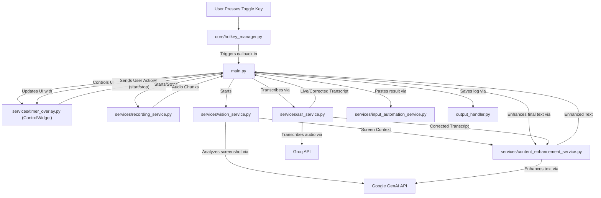
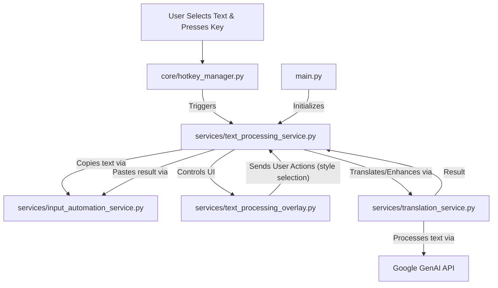

# 应用程序架构

本文档概述了应用程序的架构，为清晰起见，分为多个图表。

## 1. 高层组件架构

此图显示了主要组件以及它们与两个主要用户触发流程的关系。

## 2. 流程 1：带视觉的语音转文本

此流程由全局热键触发以开始/停止录音。它捕获音频和屏幕上下文，转录音频，通过视觉分析增强文本，并输出结果。

## 3. 流程 2：选定文本处理

此流程在选定文本时由不同的热键触发。它复制文本，翻译或增强其样式，然后将结果粘贴回去。

